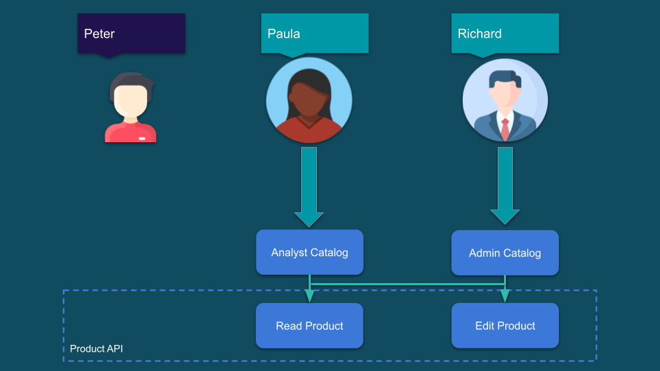

# Keycloak integration with OpenFGA (based on Zanzibar) for Fine-Grained Authorization at Scale (ReBAC)
This repository contains a PoC implemented with [Keycloak](https://www.keycloak.org/) integrated with [OpenFGA](https://openfga.dev/) on demostrating how to apply fine-grained access control in a high performance and flexible authorization.

This workshop is based the following article [Keycloak integration with OpenFGA (based on Zanzibar) for Fine-Grained Authorization at Scale (ReBAC)](https://embesozzi.medium.com/keycloak-integration-with-openfga-based-on-zanzibar-for-fine-grained-authorization-at-scale-d3376de00f9a). You will find there full details about the authorization architecture guidelines and involved components.

Nevertheless, here is the overview of the components:


Keycloak (A) is responsible for handling the authentication with the standard OpenID Connect and is managing the user access with his Role Model.

OpenFGA (C) is responsible for applying fine-grained access control. The OpenFGA service answers authorization checks by determining whether a relationship exists between an object and a user.

The PoC uses a Keycloak custom extension [keycloak-openfga-event-listener](https://github.com/embesozzi/keycloak-openfga-event-listener) which:
1. listens to the Keycloak events: 
   * User Role Assignment
   * User Group Assignment
   * Role to Role Assignment 
   * User Group Assignment 
2. translates this event to an OpenFGA tuple based on the [OpenFGA Keycloak Authz Schema](openfga/keycloak-authorization-model.json)
3. publishes the event to the OpenFGA Solution (*)

(*) So far we don’t have an official Java SDK OpenFGA client to publish the authorization tuples. This is why I have decided to use an Apache Kafka cluster for publishing the events. Kafka is a messaging system that safely moves data between systems. These events will be consumed by a Kafka consumer client (B) that using the OpenFGA SDK will publish the tuples to the OpenFGA Solution.

Then the application or API (4/5) can do an authorization check invoking the OpenFGA service.

# Use Case Overview

As an example, we will implement an Product Catalog web application that has the following requirements:
* Only authenticated user with MFA can access to the application
* Product can be viewed by their Analyst
* Product can be edited by their Admin
* Global Admin users can view or edit any Product

More details are described in the [article](https://embesozzi.medium.com/keycloak-integration-with-openfga-based-on-zanzibar-for-fine-grained-authorization-at-scale-d3376de00f9a).

In this repo you will see the following components running as containers in two docker-compose files:

| Component                 |  Description                |  Image         | 
| ------------------------- |-----------------------------|:--------------:|
| Keycloak                  |   Keycloak is configured with Custom extension Keycloak OpenFGA Event Listener    |  quay.io/keycloak/keycloak:19.0.2 |      
| OpenFGA                   |   OpenFGA is configured with Keycloak Authz Schema                                |     openfga/openfga:latest        | 
| Kakfa Cluster             |   Single Node Kakfa Cluster                                                       |   confluentinc/cp-zookeeper:7.2.2<br />confluentinc/cp-kafka:7.2.2|
| Kafka OpenFGA Consumer    |   Node.js Kafka OpenFGA Consumer is configured to send the events to the OpenFGA  |    Custom image                   | 
| Store Portal              |   Vue.js Web Application is integrated with Keycloak by OpenID Connect            |    Custom image                   |
| Store API                 |   Node.js API is protected by OAuth 2.0 and it utilizes the OpenFGA SDK for FGA.  |    Custom image                   |


# How to install?
## Prerequisites

 * Install Git, [Docker](https://www.docker.com/get-docker) and [Docker Compose](https://docs.docker.com/compose/install/#install-compose) in order to run the steps provided in the next section<br>

## Deploy the PoC

1. Clone this repository
    ````bash
    git clone https://github.com/embesozzi/keycloak-openfga-workshop
    cd keycloak-openfga-workshop
    ````

2. Execute following Docker Compose command to start the deployment

   ```sh
   docker-compose -f docker-compose.yml -f docker-compose-apps.yml up
   ```

3. To be able to use this environment, you need to add this line to your local HOSTS file:

   ```sh
   127.0.0.1  keycloak openfga store store-api
   ```

4. Access the following web UIs using URLs bellow via a web browser.

    | Component                 |  URI                          |  Username   | Password    |
    | ------------------------- |:-----------------------------:|:-----------:|:-----------:|
    | Keycloak Consol           |   http://keycloak:8081        |  admin      |  password   |
    | OpenFGA Playground        |   http://localhost:3000       |             |             |
    | OpenFGA API               |   http://localhost:8080       |             |             |
    | Store Portal              |   http://store:9090           |             |             |
    | Store API                 |   http://store-api:9091       |             |             |


## Post configuration steps

### OpenFGA
1. Import the OpenFGA authorization schema for Keycloak:
    ```bash
    cd openfga
    ./import.sh
    ```
2. As the result you will see the following OpenFGA Authorization Model in the [OpenFGA Playground Console](http://localhost:8080) :

    

### Keycloak
1. Enable the Keycloak OpenFGA Event Listener extension in Keycloak:

    * Open administration console
    * Choose realm
    * Go to Events
    * Open `Config` tab and add `openfga-events` to Event Listeners.


2. Proceed to initialize the PoC:

    In order to simply the PoC configuration, proceed to execute the following script to initialize the PoC:

    ```bash
    docker exec keycloak /bin/bash /opt/keycloak/initialize-poc.sh
    ```

    This script will create the OAuth Clients and the following Users and Role Model:

    

    The password for all the users is `demo1234!`

    Once these steps are finished, the Keycloak OpenFGA Event Listener extension has to proceed to publish these events to the Kafka topic called “openfga-topic”. Then, the Kafka consumer has published those events to the OpenGFA store using the SDK. Here are all tuples stored.

    | User                      |  Relation                     |  Object               | 
    | ------------------------- |:-----------------------------:|:---------------------:|
    | role:admin-catalog        |   parent                      |  role:view-product    |
    | group:global-admin        |   parent_group                |  role:admin-catalog   |
    | role:analyst-catalog      |   parent                      |  role:view-product    |
    | role:admin-catalog        |   parent                      |  role:view-product    |
    | role:admin-catalog        |   parent                      |  role:edit-product    |
    | paula                     |   assignee                    |  role:analyst-catalog |
    | richard                   |   assignee                    |  role:admin-catalog   |


3. Restart the apps (containers: `store-oidc-app` and `store-openfga-api`)

## Test cases
You can follow the test cases described in the article [Keycloak integration with OpenFGA (based on Zanzibar) for Fine-Grained Authorization at Scale (ReBAC)](https://embesozzi.medium.com/keycloak-integration-with-openfga-based-on-zanzibar-for-fine-grained-authorization-at-scale-d3376de00f9a).

In the article you will see an example of the keycloak Role and Group model and how the API is protecting the services based on the OpenFGA authorization model.
